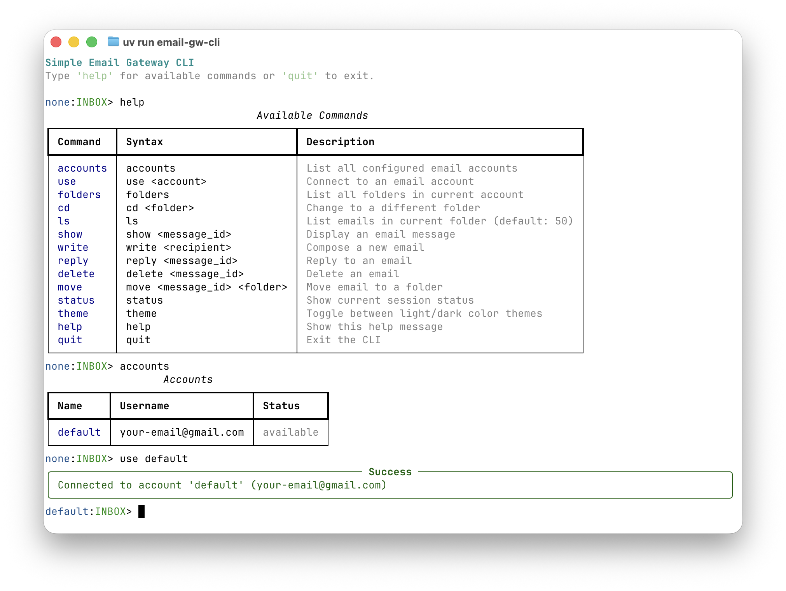

# Interactive CLI

The simple-email-gw package includes an interactive command-line interface (CLI) for managing email operations directly from your terminal.

## Overview

The CLI provides a user-friendly interface for common email operations:

- Browse email accounts and folders
- View and search emails
- Compose and send new emails
- Reply to emails
- Manage email folders



## Installation

The CLI is included with the package. Install using pip or uv:

```bash
# Using pip
pip install simple-email-gw

# Using uv
uv add simple-email-gw
```

## Configuration

### Environment Variables

The CLI automatically loads configuration from a `.env` file in the current directory. Copy `.env.example` to `.env` and configure your email accounts:

```bash
# Copy the example configuration
cp .env.example .env

# Edit with your email account details
nano .env  # or use your preferred editor
```

### Single Account

Configure a single email account using environment variables:

```bash
EMAIL_IMAP_HOST=imap.gmail.com
EMAIL_SMTP_HOST=smtp.gmail.com
EMAIL_USERNAME=your-email@gmail.com
EMAIL_PASSWORD=your-app-password
```

### Multiple Accounts

Configure multiple accounts using JSON format:

```bash
EMAIL_ACCOUNTS_JSON='[{"name":"work","imap_host":"imap.gmail.com","smtp_host":"smtp.gmail.com","username":"work@example.com","password":"secret"},{"name":"personal","imap_host":"imap.icloud.com","smtp_host":"smtp.icloud.com","username":"personal@icloud.com","password":"secret"}]'
```

## Starting the CLI

Run the CLI using the installed entry point:

```bash
# If installed with pip
email-gw-cli

# If running from source
uv run email-gw-cli
```

## Basic Commands

### Getting Help

Display all available commands:

```
none:INBOX> help
```

The help command shows:

- **Command** - The command name
- **Syntax** - How to use the command
- **Description** - What the command does

### Listing Accounts

View all configured email accounts:

```
none:INBOX> accounts
```

This displays a table showing:

- **Name** - Account identifier
- **Username** - Email address
- **Status** - Connection status (`available` or `connected`)

### Selecting an Account

Connect to an email account:

```
none:INBOX> use <account_name>
```

Example:

```
none:INBOX> use work
Connected to account 'work' (work@example.com)
work:INBOX> 
```

Once connected:

- The prompt changes from `none:INBOX>` to `account_name:INBOX>`
- The account status shows `connected` in the accounts list
- Email commands become available (folders, ls, show, etc.)

### Theme Customization

Toggle between light and dark color themes:

```
none:INBOX> theme
```

The CLI supports two themes:

- **Light theme** - Optimized for white/light terminal backgrounds (default)
- **Dark theme** - Optimized for black/dark terminal backgrounds

The theme affects:

- Text colors (account names, folder names, email IDs)
- Status indicators (read/unread, connected/available)
- Help and status panel colors

### Checking Status

View current session status:

```
work:INBOX> status
```

This shows:

- **Account** - Current account name and email
- **Folder** - Current folder
- **Connection** - Connection status
- **IMAP/SMTP Server** - Server addresses (when connected)

### Command History

The CLI automatically saves your command history to `~/.email_gw_history`. Use:

- **↑/↓ arrows** - Navigate through previous commands
- **Ctrl+R** - Search through command history
- History persists across sessions

### Exiting the CLI

Exit the CLI using:

```
work:INBOX> quit
```

Or press **Ctrl+D** to exit.

## Color Themes

### Light Backgrounds (Default)

Optimized for white/light terminal backgrounds:

- Uses darker colors for better contrast
- Account names: dark blue
- Folder names: dark green
- Secondary text: grey (not dim)
- Error/success/warning: dark red/green/yellow

### Dark Backgrounds

Optimized for black/dark terminal backgrounds:

- Uses bright colors for better contrast
- Account names: cyan
- Folder names: green
- Secondary text: dim
- Error/success/warning: red/green/yellow

Switch between themes using the `theme` command to match your terminal background.

## Composing and Replying

### Compose a new email

```
work:INBOX> write alice@example.com
```

After entering the subject and body, the CLI shows a preview and asks for confirmation before sending.

### Reply to an email

```
work:INBOX> reply <id>
```

The reply command loads the original email by ID, sets the recipient to the sender, and quotes the original body. You can then add your response and confirm the send.

### Save a copy to the Sent folder

By default, sent messages are not appended to the IMAP Sent folder. You can opt-in to saving a copy using the `--sent` flag (also `--save-sent`):

```
work:INBOX> write --sent alice@example.com
work:INBOX> reply --sent 42
```

When `--sent` is used, the preview table shows `Save to Sent: Yes (auto-detected)` and the CLI asks:

```
Save a copy to Sent folder? (y/n):
```

If you confirm with `y` or `yes`, the CLI fetches the current IMAP session and passes it to the SMTP client so the message can be appended to Sent after a successful send.

### Choose a custom Sent folder

If your provider uses a non-standard Sent folder name, override it with `--sent-folder`:

```
work:INBOX> write --sent --sent-folder "Sent Items" alice@example.com
work:INBOX> reply --sent --sent-folder "Sent Messages" 42
```

`--sent-folder` must always be paired with `--sent` (or `--save-sent`). Using it alone results in an error.

## Next Steps

After connecting to an account, you can:

- List folders with `folders`
- Browse emails with `ls`
- View emails with `show <id>`
- Compose new emails with `write <recipient>`
- Reply to emails with `reply <id>`
- Save copies to your Sent folder with `write --sent` or `reply --sent`

See the command reference in the help menu for all available commands.

## Environment File Example

Create a `.env` file in your project directory:

```bash
# Single account configuration
EMAIL_IMAP_HOST=imap.gmail.com
EMAIL_SMTP_HOST=smtp.gmail.com
EMAIL_USERNAME=your-email@gmail.com
EMAIL_PASSWORD=your-app-password

# Optional: Multiple accounts
# EMAIL_ACCOUNTS_JSON='[...]' 

# Optional: Rate limiting
# EMAIL_RATE_LIMIT_REQUESTS_PER_MINUTE=60
# EMAIL_RATE_LIMIT_SENDS_PER_HOUR=100

# Optional: Recipient whitelist
# EMAIL_RECIPIENT_WHITELIST_DOMAINS=gmail.com,icloud.com
# EMAIL_RECIPIENT_WHITELIST_ADDRESSES=admin@company.com
```

## Security Notes

- The `.env` file is automatically ignored by git (see `.gitignore`)
- Use app-specific passwords for Gmail and other providers
- Never commit your `.env` file to version control
- Recipient whitelists help prevent accidental emails to unintended recipients

## Troubleshooting

### No accounts configured

Make sure you've created a `.env` file with your email configuration:

```bash
cp .env.example .env
# Edit .env with your email details
```

### Connection failed

- Verify your IMAP/SMTP host addresses
- Check your username and password
- Ensure you're using an app-specific password (for Gmail, iCloud, etc.)
- Verify TLS is supported by your email provider

### Theme colors hard to read

If colors are hard to read on your terminal background, switch themes:

```bash
none:INBOX> theme
```

Toggle between light and dark themes until you find one that works well with your terminal.